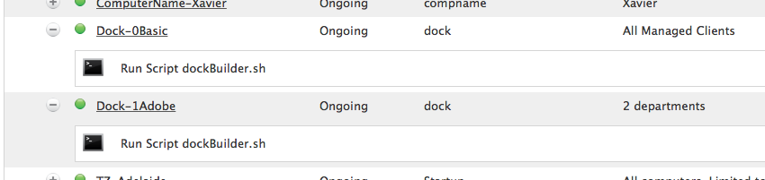
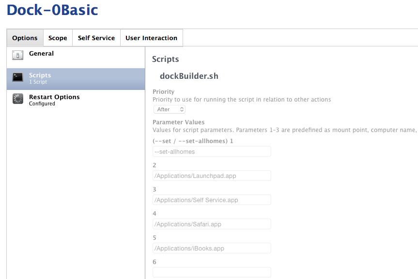
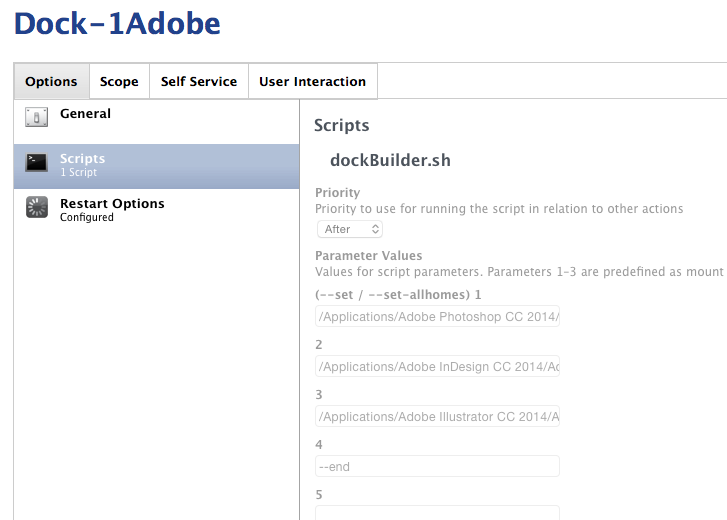

dockBuilder
===========

### Progmatically build a Dock with dockutil & Casper ###

**TODO:** handle ~ for the user template if possible ?


[dockutil](https://github.com/kcrawford/dockutil) rocks, but it handles one item at a time. I see people on jamfnation rolling their docks in firstboot scripts, but I wanted something that I could leverage in JSS policies, and then scope accordingly.

Using dockBuilder in a policy based build / provisioning "imaging" workflow means you can leverage all JSS data to roll a default dock.


eg. dockBuilder.sh --reset-allhomes "/Applications/Safari.app" "/Applications/Launchpad.app" "/Applications/Self Service.app".

Would set all existing users and the user template to a very basic Dock.


Instructions
------------

1. Install [dockutil](https://github.com/kcrawford/dockutil) on your client macs
2. Edit the dockutil variable to reflect it's location on client mac.
3. Create a policy as part of your build process.
4. Add the script
5. Fill in the parameters *(see examples below)*
6.

It accepts the following switches

```
	--reset
	 resets the user template to blank (dockutil  --remove all --no-restart *usertemplate*)
	
	--reset-allhomes
	 resets the user template to blank (dockutil  --remove all --allhomes --no-restart)
	
	--end
	 when reached, and allhomes is specified it restarts the dock
```

Without any switches items are appended in order, so you can actually chain together polices to build Docks based on JSS information (eg. group membership, location info, network segments).

#### Example ####




The first policy is triggered on custom trigger dock (as part of our build process), and scope to all managed clients.



It resets the template and all homes (so we can call the dock trigger for troubleshooting if needed), and then creates a very basic Dock.



The second policy is scoped by the Department info the JSS (we use this to define our computer / software builds with [Patchoo! Deploy](https://github.com/patchoo/patchoo/blob/master/docs/patchoo_deploy_overview.md)). It adds required Adobe apps to and **--end** when done.


This gives more flexible framework to create and modify Docks in your build process!
